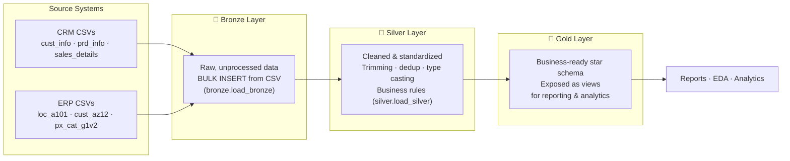
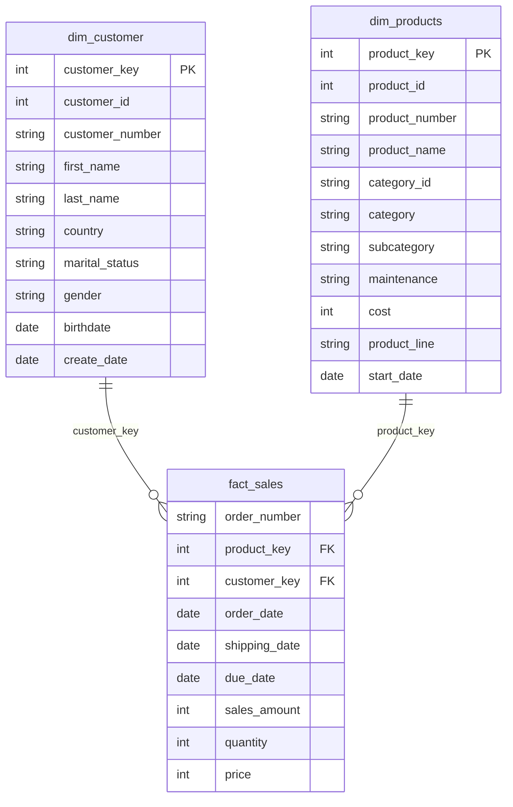

# SQL Data Warehouse Project

Building a modern data warehouse in SQL Server, including ETL processes, data modeling, and analytics — following the **Medallion Architecture** (Bronze → Silver → Gold).

Raw CRM and ERP CSV extracts are ingested, cleaned, standardized, and modeled into a star schema that's ready for reporting and analysis.

---

## Architecture

Data flows through three layers, each with a clearly defined responsibility:



| Layer | Purpose | How it's built |
|---|---|---|
| **Bronze** | Raw, as-is copy of source CSVs | `BULK INSERT` via `bronze.load_bronze` stored procedure |
| **Silver** | Cleaned, standardized, deduplicated data | `silver.load_silver` stored procedure — trims strings, standardizes codes (e.g. `M`/`F` → `Male`/`Female`), removes duplicates, fixes data types |
| **Gold** | Business-ready star schema | SQL views joining Silver tables into dimension and fact tables |

---

## Gold Layer: Star Schema

The Gold layer models the business as a classic **star schema**, with one fact table surrounded by descriptive dimension tables.



`fact_sales` sits at the center, linking to `dim_customer` and `dim_products` — a standard star schema shape that keeps queries simple and fast (single joins from fact to each dimension, no deep join chains).

---

## Repository Structure

```
sql_data_warehouse_project/
│
├── datasets/                          # Source CRM & ERP CSV files
│
├── documents/                         # Supporting docs / diagrams
│
├── script/
│   ├── Bronze/
│   │   ├── init_database.sql          # Creates DataWarehouse DB + bronze/silver/gold schemas
│   │   ├── Create_tables.sql          # DDL for raw Bronze tables
│   │   └── load_source.sql            # bronze.load_bronze — bulk loads CSVs into Bronze
│   │
│   ├── silver/
│   │   ├── silver_ddl_load.sql        # DDL for cleaned Silver tables
│   │   └── silver_load_procedure.sql  # silver.load_silver — cleans & standardizes Bronze → Silver
│   │
│   ├── gold/
│   │   └── ddl_gold.sql               # Views: gold.dim_customer, gold.dim_products, gold.fact_sales
│   │
│   ├── EDA.sql                        # Exploratory data analysis on the Gold layer
│   └── Advance_data_analytics.sql     # Deeper analytics queries (trends, segmentation, etc.)
│
├── LICENSE                            # MIT License
└── README.md
```

---

## Tech Stack

- **Database:** Microsoft SQL Server
- **Language:** T-SQL (stored procedures, views, DDL)
- **Data Loading:** `BULK INSERT` from CSV, containerized via Docker (source files mounted into the SQL Server container at `/datasets/...`)
- **Data Modeling:** Medallion Architecture (Bronze/Silver/Gold) → Star Schema

---

## Data Sources

| System | Files | Contents |
|---|---|---|
| **CRM** | `cust_info.csv`, `prd_info.csv`, `sales_details.csv` | Customer master data, product master data, sales transactions |
| **ERP** | `loc_a101.csv`, `cust_az12.csv`, `px_cat_g1v2.csv` | Customer location, customer demographics (birthdate/gender), product category hierarchy |

---

## How to Run

1. **Initialize the database and schemas**
   ```sql
   -- Run script/Bronze/init_database.sql
   -- Creates the DataWarehouse database and bronze / silver / gold schemas
   ```

2. **Create Bronze tables and load raw data**
   ```sql
   -- Run script/Bronze/Create_tables.sql
   -- Then execute the load procedure:
   EXEC bronze.load_bronze;
   ```
   > Requires the source CSVs to be accessible to the SQL Server instance (e.g. mounted into a Docker container at `/datasets/...`).

3. **Create Silver tables and run the cleaning pipeline**
   ```sql
   -- Run script/silver/silver_ddl_load.sql
   -- Then execute the load procedure:
   EXEC silver.load_silver;
   ```

4. **Create the Gold layer views**
   ```sql
   -- Run script/gold/ddl_gold.sql
   -- Creates gold.dim_customer, gold.dim_products, gold.fact_sales
   ```

5. **Explore the data**
   ```sql
   -- Run script/EDA.sql for exploratory analysis
   -- Run script/Advance_data_analytics.sql for deeper analytics
   ```

---

## License

This project is licensed under the [MIT License](LICENSE).
